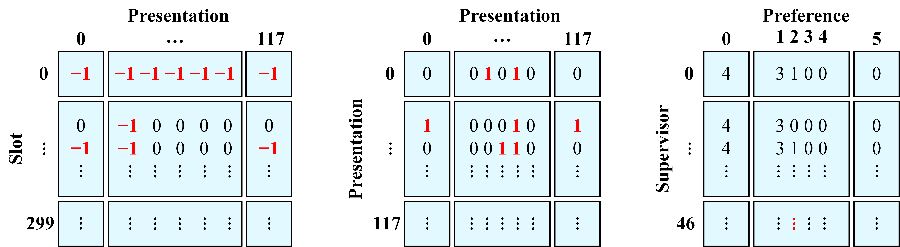

# Hybrid Genetic Algorithm-Simulated Annealing (HGASA) Algorithm for Presentation Scheduling
*[Ray Jasson](mailto:holmesqueen2070@yahoo.com)*<br>
*[Yi Qing](mailto:yiqing0519@gmail.com)*<br>
*24/07/2020*<br>

<br>

## Background of Presentation Scheduling Problem

Presentation Scheduling problem, which is analogous to the famous University Course Timetabling Problem (UCTP), involves allocating a set of presentations and resources including speakers, supervisors and venues to different time slots while considering various constraints. Supervisors have different preferences including choosing to attend certain number of consecutive presentations, choosing number of days to complete all the presentations and deciding whether they want to change venue while attending consecutive presentations. The problem is defined according to the following groups:

- Presentations
- Slots (Time slots and Venues)
- Supervisors
- Preferences

`n` presentations will be scheduled to `m` slots in which each slot is a combination of a venue and a time slot. For example, the timetable below has a total of 10 slots for 2 venues:

Day | Venue | 0900-1000 | 1000-1100 | 1100-1200 | 1300-1400 | 1400-1500
--- | ----- | --------- | --------- | --------- | --------- | ---------
Monday | Room A | 1 | 2 | 3 | 4 | 5
Monday | Room B | 6 | 7 | 8 | 9 | 10

Each presentation is presented by a speaker and supervised by three supervisors. There are `k` supervisors available. There are two types of constraints: hard constraints and soft constraints. Hard constraints cannot be violated to prevent generating an infeasible schedule, whereas soft constraints might be violated, however, the number of violations must be minimized.

- **Hard Constraints**
  - *HC01*: All presentations must be scheduled and each presentation can be scheduled only once
  - *HC02*: No supervisors can attend two or more presentations concurrently
  - *HC03*: Some venues are unavailable on specific time slots
  - *HC04*: Some supervisors are unavailable on specific time slots
  - *HC05*: All presentations must be scheduled to a slot without sharing of venues
- **Soft Constraints**
  - *SC01*: Number of consecutive presentations should not exceed supervisor’s preference
  - *SC02*: Number of days in which a supervisor needs to attend a presentation should not exceed supervisor’s preference
  - *SC03*: Some supervisors prefer not to change venue while attending consecutive presentations

<br>

## Data Input

In this repository, there are `n = 118` presentations, `m = 300` slots and `k = 47` supervisors. There are 4 venues: Viva Room (VR), Meeting Room (MR), Interaction Room (IR) and BJIM Discussion Room (BJIM). Each day has 15 slots in which each slot lasts for 30 minutes. 300 slots are shceduled from Monday until Friday.

***Note that each slot is a combination of a venue and a timeslot.***

There are 6 input files:

- `SupExaAssign.csv` specifies supervisors that are in charge of the presentations
- `HC03` specifies unavailable venues
- `HC04` specifies unavailable supervisors on specific slots
- `SC01` specifies supervisors' preferred number of consecutive presentations
- `SC02` specifies supervisors' preferred number of days to complete all the presentations
- `SC03` specifies supervisors' preferences of changing venue during consecutive presentations, `yes` indicates supervisors prefer to attend consecutive presentations without changing venue, whereas `no` indicates supervisors do not want to change venue while attending consecutive presentations

<br>

## Hybrid Genetic Algorithm-Simulated Annealing (HGASA) Algorithm 

Hybrid genetic algorithm-simulated annealing (HGASA) algorithm is the combination of genetic algorithm (GA) with simulated annealing as a local search method to accelerate the convergence speed. The figure below shows the flowchart of HGASA algorithm.

<p align="center"></p>
<p align="center"><i>Flowchart of HGASA algorithm</i></p>

Refer to `hybrid_system` function in `hybrid_system.py` for more details.

<br>

### Encoding

The initial set of candidate solutions and sets of constraints are represented using matrix. The matrices are generated using given data from input files and through the process of matrix multiplication. The figure below shows three required matrices that are generated through `load()` function in `data.py`.

<p align="center"></p>
<p align="center"><i>From left, slot-by-presentation matrix, presentation-by-presentation matrix and supervisor-by-preference matrix</i></p>

The `slot-by-presentation` matrix is the chromosome in genetic algorithm and the candidate in simulated annealing. Other matrices are required by the penalty function for evaluation of penalty points. `0` indicates the slots are available, whereas `-1` indicates the slots are unavailable due to the hard constraints. When initializing the population, `1` indicates a presentation has been assigned to a specific slot.

<br>

### Penalty Function

The penalty function is used to evaluate the fitness of the solution, which is the resulting presentation schedule. It is used to evaluate any violations of `HC02`, `SC01`, `SC02` and `SC03`. Each violation increases the penalty points by 10. The higher the penalty points, the lower the fitness of the solution.

***Note that if the number of consecutive presentations is less than the supervisor's preference, each difference will increase the penalty point by 1 in order to encourage the generated schedule to have consecutive presentations.***

Refer to `penalty_function.py` for more details.

<br>

### Steady-State Genetic Algorithm (GA)

[Steady-state genetic algorithm](https://www.cs.unm.edu/~neal.holts/dga/optimizationAlgorithms/steadyStateGA.html) is different from the generational genetic algorithm in which only two chromosomes are selected to undergo crossover and mutation to generate two children. Two worst chromosomes will be chosen from the population to be replaced by the new children. It updates the population in a piecemeal fashion rather than all at one time.

-----------------------------------

#### Initialize Population

The size of population is initialized to 10 which is an adequate size considering the size of this presentation scheduling problem. A random slot is assigned to each presentation in a chromosome. Note that the slots are assigned in a way such that the schedule does not violate `HC03` and `HC04`. Empty slot indicates no presentation is assigned to this slot previously so `HC01` and `HC05` will not be violated. Each `1`s in the `slot-by-presentation` matrix (chromosome) represents the assigned presentation in its respective slot. Penalty of chromosome is evaluated and added to the population of penalty points.

Refer to `generate_chromosome` function in `genetic_algorithm.py` and `hybrid_system.py` for more details.

-----------------------------------

#### Selection

Tournament selection with tournament size of 2 is carried out twice. In each tournament selection, two random chromosomes are selected and the chromosome with the lowest penalty point among them is selected.

Refer to `selection` function in `genetic_algorithm.py` for more details.

-----------------------------------

#### Crossover and Repair

Two-point crossover is carried out to reduce the probability of breaking up good pairs in the chromosome which is more frequent in one-point crossover and uniform crossover. The parent chromosomes selected in tournament selection exchange their presentations between the cutpoints to produce two new children. The figure below shows two parent chromosomes exchange their presentations between `c1` and `c2` to generate two new child chromosomes.

<p align="center"></p>
<p align="center"><i>Crossover of two parent chromosomes</i></p>

Repair is carried out after crossover in which the presentation is assigned to another available and empty slot if there are more than 1 presentations assigned for the slot. The purpose of this operation is to ensure `HC01` and `HC05` are not violated.

Refer to `crossover` and `repair` functions in `genetic_algorithm.py` for more details.

-----------------------------------

#### Mutation

Two random presentations have their slots exchanged. If both presentations have slots that are not exchangeable, indicating the slots are unavailable for either one of the presentation, another presentation and slot are selected randomly. The figure below shows the mutation process.

<p align="center"></p>
<p align="center"><i>Mutation of a chromosome</i></p>

Refer to `mutation` function in `genetic_algorithm.py` for more details.

-----------------------------------

#### Penalty Evaluation and Replacement

Two chromosomes with the highest penalty points are replaced by two new child chromosomes generated through crossover and mutation. Their penalty points are updated as well.The maximum number of generations is set to be `100` generations in this case. In each generation, 6 processes are executed iteratively: selection, crossover, repair, mutation, penalty evaluation and replacement until the maximum generation is reached.

Refer to `replacement` and `reproduction` functions in `genetic_algorithm.py` for more details.

<br>

### Simulated Annealing (SA)

[Simulated annealing](https://en.wikipedia.org/wiki/Simulated_annealing) (SA) is used in HGASA algorithm as a local search algorithm. SA is a metaheuristic inspired by statistical physics. SA has the ability to avoid being trapped in local minima and it is proven that SA is able to find the global optimum if given infinite time.

The initial candidate of SA is the chromosome with the lowest penalty point from the previous GA. The basic procedure of SA is to generate neighbouring solutions and evaluate them. If the neighbouring solution generated is better than the best solution, the best solution is updated. If otherwise, the neighbouring solution is accepted based on a probability density function. The best solution will only be updated when the neighbouring solution is better than the best solution. A poor neighbouring solution will be accepted by probability as the candidate to generate a new neighbouring solution, but not as the best solution. The figure below shows the process of SA.

<p align="center"></p>
<p align="center"><i>Process of Simulated Annealing</i></p>

-----------------------------------

#### Random Neighbourhood Structure

In each iteration, one neighbourhood structure will be randomly selected to be applied to the candidate solution to produce a neighbouring solution. A neighbouring solution is a solution that is slightly different from the candidate solution. There are in total four neighbourhood structures implemented:

- **Neighbourhood Structure 1**<br>
Select a supervisor at random and swap the timeslots of two presentations supervised by the supervisor
- **Neighbourhood Structure 2**<br>
Select a presentation at random and change its assigned venue without changing the assigned day and time
- **Neighbourhood Structure 3**<br>
Select a presentation at random and move it to a randomly selected empty slot
- **Neighbourhood Structure 4**<br>
Select a presentation at random and move another presentation that has at least one same supervisor to the empty slot adjacent to the presentation chosen at random

Refer to `neighbourhood_structure1`, `neighbourhood_structure2`, `neighbourhood_structure3` and `neighbourhood_structure4` functions in `simulated_annealing.py` for more details.

-----------------------------------

#### Step-by-Step Procedure

SA is carried out for a number of iterations until stopping criterion has been met. The procedure is described by the following steps:

1. **Set Initial Annealing Temperature**<br>
The initial temperature of simulated annealing is set to the difference between the lowest and highest penalty points of the population found using GA.
2. **Apply Random Neighbourhood Structure**
3. **Penalty and Acceptance Probability**<br>
The penalty of the newly generated neighbouring solution is computed and compared with the penalty of the candidate solution. The neighbouring solution is accepted if it is better than the candidate solution. In the case where there is no improvement, a random number, `R` that is uninformedly distributed between 0 and 1 is generated and the probability density function value, <i>e</i><sup>-<i>&delta;/T</i></sup> is calculated. If the probability density function value is higher than `R`, the neighbouring solution is accepted as the candidate solution to generate a new neighbouring solution.
4. **Cooling Schedule**<br>
An exponential cooling scheme (ECS) is used. The temperature decrement rule implemented is <i>T</i><sub><i>k</i> + 1</sub> = <i>&alpha;T<sub>k</sub></i> where &alpha is set to 0.9999, a value very close to 1. The temperature is decreased slowly and continuously.
5. **Final Temperature**<br>
The final temperature is the stopping condition. The final temperature is set to 0.0001 of the initial temperature.

Refer to `anneal` function in `simulated_annealing.py` for more details.

<br>

## Implementation in Python

Four external packages are used to implement HGASA algorithm:
- [NumPy](https://numpy.org/devdocs/index.html)<br>
NumPy provides a powerful n-dimensional array structure and numerical computing tools. It is ideal to create matrix, and has a significantly faster data access speed and more efficient memory usage than Python list.
- [Numba](https://numba.pydata.org/numba-doc/latest/user/5minguide.html)<br>
Numba is a just-in-time (JIT) compiler for Python that can speed up the execution of code that uses NumPy arrays and functions, and loops frequently. Parts of user-defined functions in Python are preceded with `@njit(cache=True)` decorator. `@njit()` compiles the decorated function in nopython mode so the compiled code runs without the involvement of Python interpreter. `cache=True` indicates the result of function compilation will be saved into a file-based cache to save compilation time when invoking decorated functions.
- [Matplotlib](https://matplotlib.org/api/index.html)<br>
Matplotlib is a comprehensive library to create interactive visualizations in Python. One of its API, pyplot is used to create interactive plots in a figure. The interactive plot shows the graph of penalty points improvement over the number of iterations in HGASA. The graph can be zoomed, panned, configured and saved as a figure.
- [PrettyTable](http://zetcode.com/python/prettytable/)<br>
PrettyTable can be used to visualize tabular data in ASCII table format. It is used to draw the timetable for the presentation schedule.

<br>

## Experimental Results

The table below shows the experimental result of running HGASA algorithm using the given input files where there are `n = 118` presentations, `m = 300` slots and `k = 47` supervisors. 

Experimental Run | Run 1 | Run 2 | Run 3
---------------- | ----- | ----- | -----
Hard Constraints Violated | 0 | 0 | 0
Soft Constraints Violated | 2 | 1 | 2
Penalty Points | 255 | 245 | 245
Runtime (seconds) | 62.60 | 55.75 | 54.02

***Note that all the parameters used in HGASA algorithm are purely empirical and should be adjusted for other problems.***

The generated presentation schedule is in `csv` format as shown below:
`P9, null, null, P48, P36, null, ...`
The fragmented schedule above indicates that `P9`, `P48` and `P36` are scheduled for `slot 1`, `slot 4` and `slot 5` respectively. `null` indicates no presentation is scheduled for a particular slot. An example of a timetable generated by [PrettyTable](http://zetcode.com/python/prettytable/) that shows the final presentation schedule is shown below.

```
+------+------------------+-----------+-----------+-----------+-----------+-----------+-----------+-----------+-----------+-----------+-----------+-----------+-----------+-----------+-----------+-----------+
| Day  |      Venue       | 0900-0930 | 0930-1000 | 1000-1030 | 1030-1100 | 1100-1130 | 1130-1200 | 1200-1230 | 1230-1300 | 1400-1430 | 1430-1500 | 1500-1530 | 1530-1600 | 1600-1630 | 1630-1700 | 1700-1730 |
+------+------------------+-----------+-----------+-----------+-----------+-----------+-----------+-----------+-----------+-----------+-----------+-----------+-----------+-----------+-----------+-----------+
| Mon  |    Viva Room     |    P58    |    P35    |           |    P73    |    P118   |           |           |           |           |           |           |           |           |           |           |
|      |   Meeting Room   |    P78    |    P100   |    P116   |           |    P40    |     P3    |           |           |    P92    |    P50    |    P75    |           |           |           |           |
|      | Interaction Room |           |     P6    |           |           |           |           |           |           |    P71    |    P11    |           |           |           |           |           |
|      |       BJIM       |           |           |           |           |    P57    |    P24    |     P2    |           |           |    P25    |    P88    |    P81    |    P96    |           |           |
|      |                  |           |           |           |           |           |           |           |           |           |           |           |           |           |           |           |
| Tues |    Viva Room     |    P70    |    P80    |           |    P39    |    P99    |    P23    |    P98    |           |           |           |    P14    |           |           |           |           |
|      |   Meeting Room   |           |           |    P77    |    P52    |    P17    |           |           |           |    P105   |    P62    |    P61    |    P18    |     P9    |           |           |
|      | Interaction Room |    P84    |    P91    |           |           |           |    P65    |           |           |           |     P5    |           |    P83    |    P108   |    P112   |           |
|      |       BJIM       |           |    P48    |    P32    |    P86    |    P34    |    P21    |           |           |           |    P33    |    P117   |    P37    |    P38    |           |           |
|      |                  |           |           |           |           |           |           |           |           |           |           |           |           |           |           |           |
| Wed  |    Viva Room     |           |           |           |           |           |           |           |           |           |           |           |    P95    |    P51    |    P106   |           |
|      |   Meeting Room   |           |           |           |           |    P69    |     P1    |    P90    |           |           |           |           |           |           |           |           |
|      | Interaction Room |           |           |           |    P103   |           |           |           |           |           |           |    P19    |    P15    |           |           |           |
|      |       BJIM       |    P49    |    P13    |    P101   |           |           |           |    P41    |           |           |           |           |           |           |           |           |
|      |                  |           |           |           |           |           |           |           |           |           |           |           |           |           |           |           |
| Thu  |    Viva Room     |    P102   |    P85    |    P56    |    P79    |    P115   |    P16    |           |           |           |           |           |           |           |           |           |
|      |   Meeting Room   |           |           |           |    P26    |    P109   |    P113   |           |           |           |    P68    |    P82    |    P46    |           |           |           |
|      | Interaction Room |           |    P60    |    P114   |    P36    |    P10    |           |           |           |    P87    |    P28    |    P94    |    P53    |    P30    |           |           |
|      |       BJIM       |           |           |    P27    |    P89    |    P55    |           |           |           |           |           |    P31    |    P76    |           |           |           |
|      |                  |           |           |           |           |           |           |           |           |           |           |           |           |           |           |           |
| Fri  |    Viva Room     |           |           |    P44    |    P63    |    P67    |     P7    |           |           |           |           |    P20    |    P47    |    P22    |           |           |
|      |   Meeting Room   |           |           |    P72    |    P110   |    P64    |           |           |           |           |           |           |           |    P42    |    P43    |           |
|      | Interaction Room |    P29    |    P93    |    P97    |    P111   |           |    P59    |           |           |           |           |    P45    |    P66    |     P4    |           |           |
|      |       BJIM       |           |     P8    |    P74    |    P54    |    P107   |           |    P104   |           |           |           |           |           |    P12    |           |           |
|      |                  |           |           |           |           |           |           |           |           |           |           |           |           |           |           |           |
+------+------------------+-----------+-----------+-----------+-----------+-----------+-----------+-----------+-----------+-----------+-----------+-----------+-----------+-----------+-----------+-----------+ 
```

A graph of penalty points over number of iterations will be saved in `png` format. An example of the graph is shown below. The graph illustrates the improvement of presentation scheduling as number of iterations increases.

<p align="center"></p>
<p align="center"><i>Graph of penalty points over number of iterations</i></p>

Refer to `write` function in `data.py` for more details.

<br>

## Program Execution

Windows commands for Python package installation:

- `NumPy` $ pip install numpy
- `Numba` $ pip install numba
- `Matplotlib` $ pip install matplotlib
- `PrettyTable` $ pip install PTable

There should be a folder named `input_files` in the same directory that contains all the `csv` files (`SupExaAssign.csv`, `HC03.csv`, `HC04.csv`, `SC01.csv`, `SC02.csv` and `SC03.csv`). 

Run `hybrid_system.py`.

***Modify*** `data.py` ***and*** `input_files` ***for other data formats, such as*** `json` ***or*** `txt`.

<br>

## References

- Luke, S. (2015, October). Essentials of Metaheuristics. Retrieved June 8, 2020, from https://cs.gmu.edu/~sean/book/metaheuristics/Essentials.pdf
- Kohshori, M. S., & Abadeh, M. S. (2012, March). Hybrid Genetic Algorithms for University Course Timetabling. IJCSI International Journal of Computer Science, 9(2), 446-455.
- [Evolutionary Timetable Scheduling in Python](https://github.com/Baksonator/evolutionary-timetable-scheduling)
- [Nice Introduction to Genetic Algorithm on GitHub](https://github.com/wurmen/Genetic-Algorithm-for-Job-Shop-Scheduling-and-NSGA-II)
- [Algorithm for creating a school timetable on Stack Overflow](https://stackoverflow.com/a/8578980/10661805)
- [International Timetabling Competition 2002 Results](http://sferics.idsia.ch/Files/ttcomp2002/results.htm)
